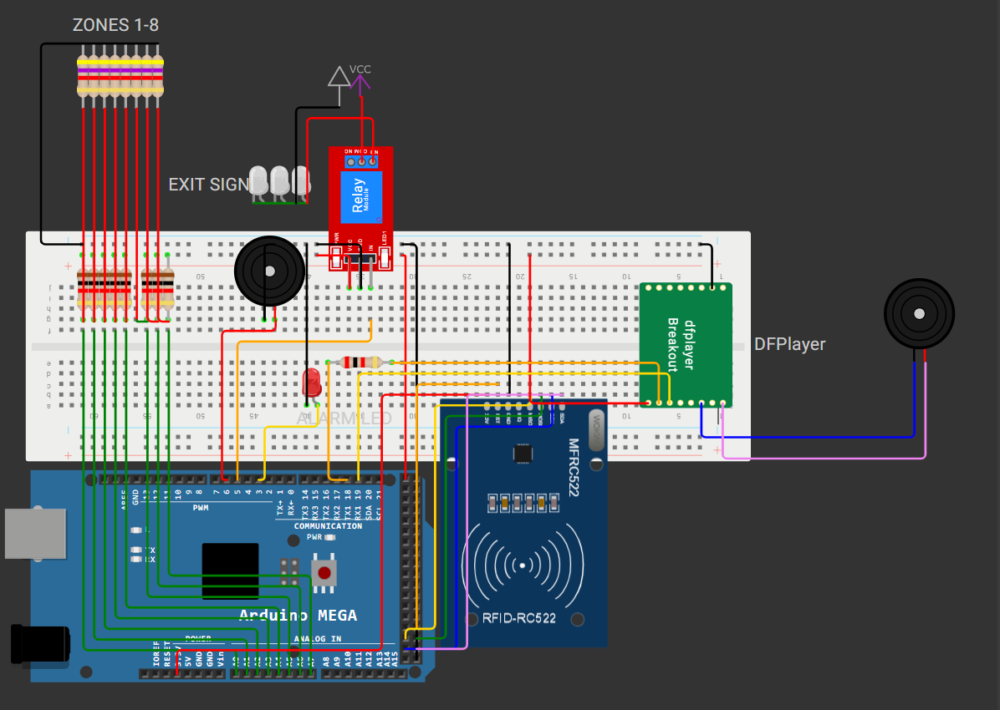

# 📸 Media: Photo & Video

[RU]
В этой папке собраны визуальные материалы проекта: от виртуальной схемы до демонстрации работы готового устройства.

### 🖼 Фотографии
**Схема (Wokwi):**

*Визуализация подключений в симуляторе.*

**Собранное устройство:**

### 🎥 Видео демонстрация
* [🎬 Дневной режим (Работа системы)](./Video1.mkv)
* [🎬 Ночной режим (Работа системы)](./Video2.mkv)

---

[EN]
This folder contains visual materials for the project: from the virtual circuit to the finished device demonstration.

### 🖼 Photographs
**Schematic (Wokwi):**

*Wiring visualization in the simulator.*

**Assembled Device:**

### 🎥 Video Demonstration
* [🎬 Day Mode (System Operation)](./Video1.mkv)
* [🎬 Night Mode (System Operation)](./Video2.mkv)

---
### 💡 Как просмотреть / How to view:
* **Фото (Photos):** Отображаются автоматически выше. / Displayed automatically above.
* **Видео (Videos):** Нажмите на ссылку, чтобы скачать и посмотреть файл. / Click the link to download and watch the file.
* 
